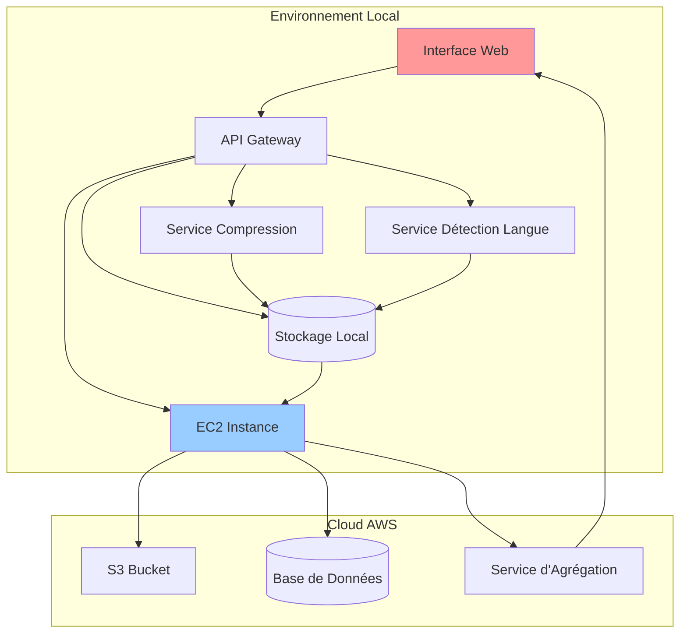

# **VidP: Pipeline Hybride de Traitement Vidéo**


 


**Un pipeline de traitement vidéo hybride combinant des conteneurs locaux et des ressources cloud AWS**

## **📋 Table des Matières**
- [📖 Vue d'ensemble](#-vue-densemble)
- [🎯 Fonctionnalités](#-fonctionnalités)
- [🏗️ Architecture](#️-architecture) 
- [📊 API Documentation](#-api-documentation) 

## **📖 Vue d'ensemble**

VidP est une solution de traitement vidéo hybride qui combine :
- **Traitement local** via des conteneurs Docker pour la compression et la détection de langage
- **Stockage et agrégation cloud** via des instances AWS EC2
- **Interface web** pour l'affichage public des résultats

Le pipeline traite des vidéos provenant de trois sources :
1. **URLs externes** (téléchargement)
2. **Fichiers locaux** (stockage local)
3. **Upload direct** (interface web)

## **🎯 Fonctionnalités**

### **🎥 Compression Vidéo**
- Compression à différentes résolutions (240p, 360p, 480p, 720p, 1080p)
- Ajustement de la qualité via paramètre CRF (18-30)
- Préservation de l'audio
- Métadonnées complètes (taille, durée, ratio de compression)

### **🌍 Détection de Langue**
- Détection de 15 langues supportées
- Transcription d'échantillon audio
- Score de confiance
- Mode synchrone/asynchrone

### **📝 Service de Sous-titrage Automatique**
- **OpenAI Whisper** : Modèles tiny/base/small/medium/large
- **Génération SRT/ASS** : Formats standard industrie
- **Intégration visuelle** : Sous-titres embarqués dans la vidéo
- **Multi-langues** : Support 100+ langues
- **Style personnalisable** : Police, couleur, position


## **🏗️ Architecture**



### **Architecture Technique**
```
Local Processing (Containers)
├── Video Compression Service
├── Language Detection Service
├── Subtitle Service
├── Animal Detection Service
└── API Gateway

```

## **⚙️ Installation & Déploiement**

### **Prérequis** 
- Python 3.9+ 


## **API Directe**


### **1. Service de Compression (`app_compression/`)**
**Port : 8001**
```python
# Endpoints principaux
POST /api/compress/url      # Compression depuis URL
POST /api/compress/local    # Compression fichier local  
POST /api/compress/upload   # Upload + compression
GET  /api/status/{job_id}   # Statut traitement
GET  /api/download/{job_id} # Téléchargement résultat
```

### **2. Service de Détection (`app_detection/`)**
**Port : 8002**
```python
# Endpoints principaux
POST /api/detect            # Détection depuis URL
POST /api/detect/local      # Détection fichier local
POST /api/detect/upload     # Upload + détection
GET  /api/languages         # Langues supportées
GET  /api/status/{job_id}   # Statut détection
```

### **3. Service de Sous-titrage (`app_subtitle/`)**
**Port : 8003**
```python
# Endpoints principaux
POST /api/generate-subtitles/  # Génération sous-titres
GET  /api/download-subtitles/{filename}  # Téléchargement SRT
GET  /api/health               # Vérification service
```


### **Documentation Interactive**
- Swagger UI: `http://localhost:8000/docs`
- ReDoc: `http://localhost:8000/redoc`


