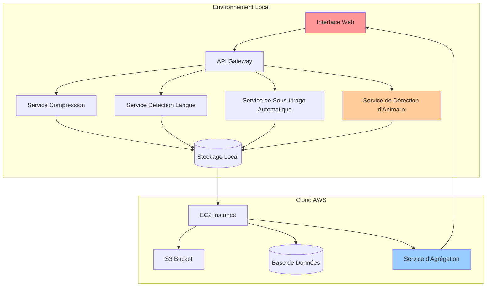

# **VidP: Pipeline Hybride de Traitement Vidéo**


 


**Un pipeline de traitement vidéo hybride combinant des conteneurs locaux et des ressources cloud AWS**

## **📋 Table des Matières**
- [📖 Vue d'ensemble](#-vue-densemble)
- [🎯 Fonctionnalités](#-fonctionnalités)
- [🏗️ Architecture](#️-architecture) 
- [📊 API Documentation](#-api-documentation)
- [⚙️ Installation & Déploiement](#️-installation--déploiement)

## **📖 Vue d'ensemble**

VidP est une solution de traitement vidéo hybride qui combine :
- **Traitement local** via des conteneurs Docker pour la compression, la détection de langage, le sous-titrage et la détection d'animaux
- **Stockage et agrégation cloud** via des instances AWS EC2
- **Interface web** pour l'affichage public des résultats

Le pipeline traite des vidéos provenant de trois sources :
1. **URLs externes** (téléchargement)
2. **Fichiers locaux** (stockage local)
3. **Upload direct** (interface web)

## **🎯 Fonctionnalités**

### **🎥 Compression Vidéo**
- Compression à différentes résolutions (240p, 360p, 480p, 720p, 1080p)
- Ajustement de la qualité via paramètre CRF (18-30)
- Préservation de l'audio
- Métadonnées complètes (taille, durée, ratio de compression)

### **🌍 Détection de Langue**
- Détection de 15 langues supportées
- Transcription d'échantillon audio
- Score de confiance
- Mode synchrone/asynchrone

### **📝 Service de Sous-titrage Automatique**
- **OpenAI Whisper** : Modèles tiny/base/small/medium/large
- **Génération SRT/ASS** : Formats standard industrie
- **Intégration visuelle** : Sous-titres embarqués dans la vidéo
- **Multi-langues** : Support 100+ langues
- **Style personnalisable** : Police, couleur, position

### **🦁 Service de Détection d'Animaux**
- **YOLOv8** : Détection en temps réel avec modèle pré-entraîné
- **80+ classes d'objets** : Chat, chien, cheval, éléphant, ours, zèbre, girafe, etc.
- **Tracking d'objets** : Suivi des animaux à travers les frames
- **Statistiques détaillées** : Comptage, confiance, timeline des détections
- **Vidéo annotée** : Génération automatique avec bounding boxes
- **Détection image** : Support pour images statiques
- **Ajustement de confiance** : Seuil personnalisable (0-1)

## **🏗️ Architecture**



### **Architecture Technique**
```
VidP/
├── app_compression/          # Service de compression vidéo
│   ├── main.py
│   ├── requirements.txt
│   └── Dockerfile
│
├── app_detection/            # Service de détection de langue
│   ├── main.py
│   ├── requirements.txt
│   └── Dockerfile
│
├── app_subtitle/             # Service de sous-titrage
│   ├── main.py
│   ├── requirements.txt
│   └── Dockerfile
│
├── app_animal_detect/        # Service de détection d'animaux
│   ├── main.py              # API FastAPI + YOLO
│   ├── requirements.txt     # Dependencies (ultralytics, opencv)
│   ├── Dockerfile
│   ├── uploads/             # Vidéos uploadées (temp)
│   └── outputs/             # Vidéos annotées
│
├── api_gateway/              # Gateway principal
│   └── main.py
│
└── docker-compose.yml        # Orchestration des services
```

## **📊 API Documentation**

### **1. Service de Compression (`app_compression/`)**
**Port : 8001**
```python
# Endpoints principaux
POST /api/compress/url      # Compression depuis URL
POST /api/compress/local    # Compression fichier local  
POST /api/compress/upload   # Upload + compression
GET  /api/status/{job_id}   # Statut traitement
GET  /api/download/{job_id} # Téléchargement résultat
```

### **2. Service de Détection de Langue (`app_detection/`)**
**Port : 8002**
```python
# Endpoints principaux
POST /api/detect            # Détection depuis URL
POST /api/detect/local      # Détection fichier local
POST /api/detect/upload     # Upload + détection
GET  /api/languages         # Langues supportées
GET  /api/status/{job_id}   # Statut détection
```

### **3. Service de Sous-titrage (`app_subtitle/`)**
**Port : 8003**
```python
# Endpoints principaux
POST /api/generate-subtitles/  # Génération sous-titres
GET  /api/download-subtitles/{filename}  # Téléchargement SRT
GET  /api/health               # Vérification service
```

### **4. Service de Détection d'Animaux (`app_animal_detect/`)**
**Port : 8004**
```python
# Endpoints principaux
POST /detect                      # Détection dans vidéo uploadée
     - file: UploadFile          # Fichier vidéo (mp4, avi, mov, mkv)
     - confidence_threshold: float # Seuil de confiance (0.0-1.0)
     - save_video: bool           # Sauvegarder vidéo annotée

POST /detect/frame               # Détection sur image unique
     - file: UploadFile          # Fichier image (jpg, png)
     - confidence_threshold: float

GET  /animals                    # Liste des classes détectables
GET  /output/{filename}          # Télécharger vidéo annotée
DELETE /output/{filename}        # Supprimer fichier traité
GET  /health                     # Vérification service

# Exemple de réponse /detect
{
  "video_info": {
    "duration_seconds": 30.5,
    "fps": 30,
    "resolution": "1920x1080",
    "total_frames": 915
  },
  "detection_summary": {
    "total_detections": 145,
    "unique_classes": 5,
    "animals_detected": {
      "dog": 45,
      "cat": 30,
      "horse": 25,
      "bird": 35,
      "elephant": 10
    },
    "frames_with_detections": 287
  },
  "detailed_detections": [...],
  "output_video": "outputs/output_20260104_143025.mp4"
}
```

### **Documentation Interactive**
- Swagger UI: `http://localhost:8000/docs`
- ReDoc: `http://localhost:8000/redoc`
- Service Animal Detection: `http://localhost:8004/docs`

## **⚙️ Installation & Déploiement**

### **Prérequis** 
- Python 3.9+
- Docker & Docker Compose
- FFmpeg (pour compression et sous-titrage)
- 4GB+ RAM (pour YOLO)

### **Installation Locale**

```bash
# Cloner le repository
git clone https://github.com/your-repo/vidp.git
cd vidp

# Créer un environnement virtuel
python -m venv venv
source venv/bin/activate  # Linux/Mac
# ou
venv\Scripts\activate     # Windows

# Installer les dépendances (service par service)
cd app_animal_detect
pip install -r requirements.txt

# Le modèle YOLOv8n sera téléchargé automatiquement au premier lancement
```

### **Déploiement Docker**

```bash
# Construire tous les services
docker-compose build

# Démarrer le pipeline complet
docker-compose up -d

# Vérifier les services
docker-compose ps

# Logs d'un service spécifique
docker-compose logs -f app_animal_detect

# Arrêter tous les services
docker-compose down
```

### **Dockerfile - Service Animal Detection**
```dockerfile
FROM python:3.9-slim

WORKDIR /app

# Installer dépendances système
RUN apt-get update && apt-get install -y \
    libgl1-mesa-glx \
    libglib2.0-0 \
    && rm -rf /var/lib/apt/lists/*

# Copier et installer requirements
COPY requirements.txt .
RUN pip install --no-cache-dir -r requirements.txt

# Copier le code
COPY . .

# Créer les dossiers nécessaires
RUN mkdir -p uploads outputs

# Exposer le port
EXPOSE 8004

# Lancer l'application
CMD ["uvicorn", "main:app", "--host", "0.0.0.0", "--port", "8004"]
```

### **Docker Compose - Extrait**
```yaml
version: '3.8'

services:
  app_animal_detect:
    build: ./app_animal_detect
    container_name: animal_detection_service
    ports:
      - "8004:8004"
    volumes:
      - ./app_animal_detect/uploads:/app/uploads
      - ./app_animal_detect/outputs:/app/outputs
    environment:
      - MODEL_NAME=yolov8n.pt
      - CONFIDENCE_THRESHOLD=0.5
    restart: unless-stopped
    networks:
      - vidp_network

networks:
  vidp_network:
    driver: bridge
```

## **🚀 Utilisation**

### **Exemple cURL - Détection d'Animaux**

```bash
# Détecter les animaux dans une vidéo
curl -X POST "http://localhost:8004/detect" \
  -F "file=@safari_video.mp4" \
  -F "confidence_threshold=0.6" \
  -F "save_video=true"

# Détecter dans une image
curl -X POST "http://localhost:8004/detect/frame" \
  -F "file=@animal_photo.jpg" \
  -F "confidence_threshold=0.5"

# Liste des animaux détectables
curl "http://localhost:8004/animals"

# Télécharger la vidéo annotée
curl "http://localhost:8004/output/output_20260104_143025.mp4" \
  --output result.mp4
```

### **Exemple Python**

```python
import requests

# Upload et détection
with open("video_safari.mp4", "rb") as f:
    response = requests.post(
        "http://localhost:8004/detect",
        files={"file": f},
        data={
            "confidence_threshold": 0.6,
            "save_video": True
        }
    )

result = response.json()
print(f"Animaux détectés: {result['detection_summary']['animals_detected']}")
print(f"Total détections: {result['detection_summary']['total_detections']}")

# Télécharger la vidéo annotée
if result['output_video']:
    filename = result['output_video'].split('/')[-1]
    video_response = requests.get(f"http://localhost:8004/output/{filename}")
    with open("annotated_video.mp4", "wb") as f:
        f.write(video_response.content)
```

## **🔧 Configuration**

### **Variables d'Environnement**

```bash
# Service Animal Detection
MODEL_NAME=yolov8n.pt              # Modèle YOLO (n/s/m/l/x)
CONFIDENCE_THRESHOLD=0.5           # Seuil par défaut
MAX_VIDEO_SIZE_MB=500              # Taille max upload
UPLOAD_RETENTION_HOURS=24          # Durée conservation uploads
OUTPUT_RETENTION_HOURS=48          # Durée conservation outputs
```

## **📈 Performance**

### **Benchmarks - Service Animal Detection**

| Résolution | FPS Traitement | RAM Utilisée | Temps (30s vidéo) |
|-----------|----------------|--------------|-------------------|
| 480p      | 25-30 fps      | 2.5 GB       | ~35s             |
| 720p      | 15-20 fps      | 3.2 GB       | ~55s             |
| 1080p     | 8-12 fps       | 4.1 GB       | ~90s             |

*YOLOv8n sur CPU Intel i7, 16GB RAM*

## **🔗 Liens Utiles**

- [Documentation Ultralytics YOLOv8](https://docs.ultralytics.com/)
- [FastAPI Documentation](https://fastapi.tiangolo.com/)
- [OpenCV Documentation](https://docs.opencv.org/)
- [AWS EC2 Guide](https://aws.amazon.com/ec2/)


